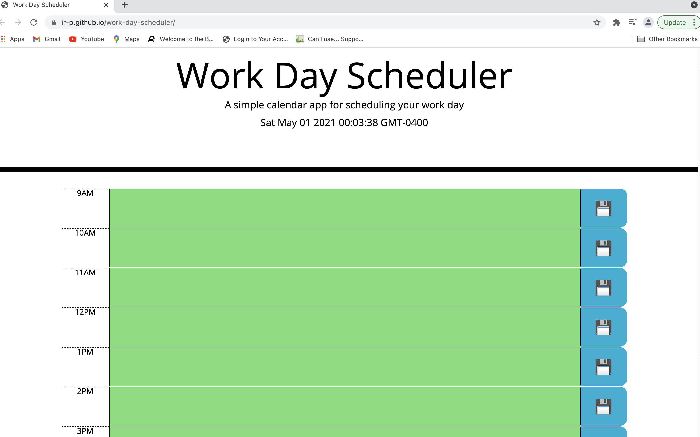

# work-day-scheduler
This app is an interactive planner which was built using HTML, CSS, JavaScript and JQueries. 

## Getting Started

- clone me, or fork me
- 🌎 live at: [work-day-scheduler] (https://ir-p.github.io/work-day-scheduler/)

  
## Deployment

Just deploy, no other actions needed

## Built With

* [javascript](https://developer.mozilla.org/en-US/docs/Web/JavaScript) - logic

## Author
* Irina Pyak

## Acknowledgments
  - **Billie Thompson** - *README Template* -
    [PurpleBooth](https://github.com/PurpleBooth)